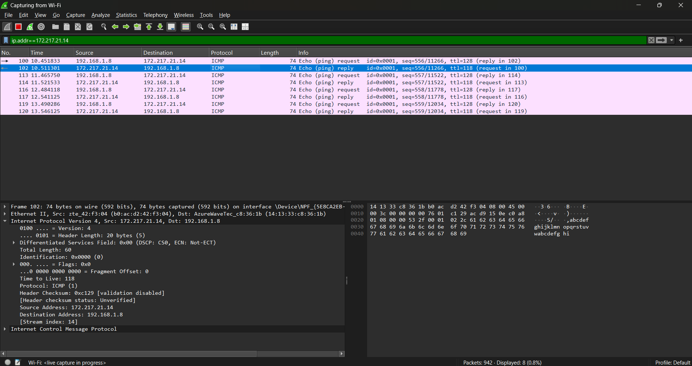
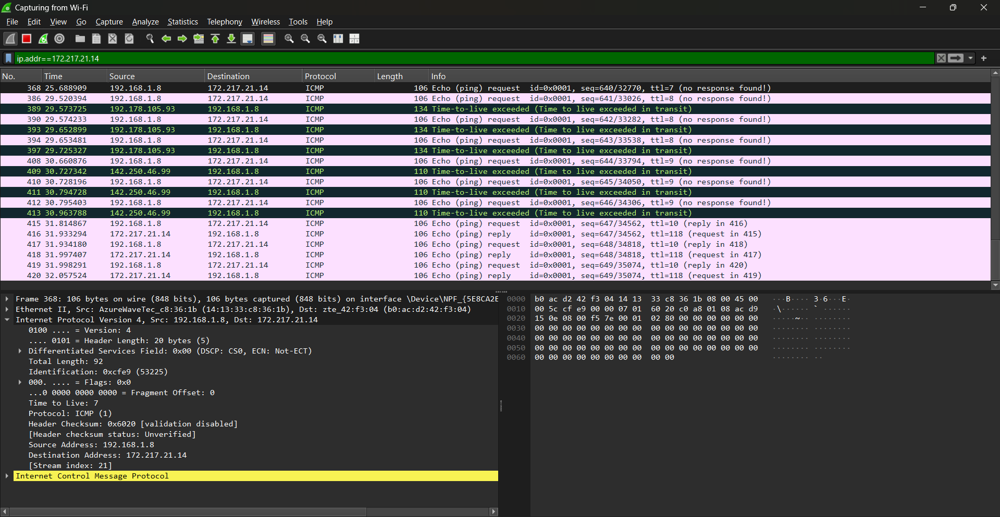
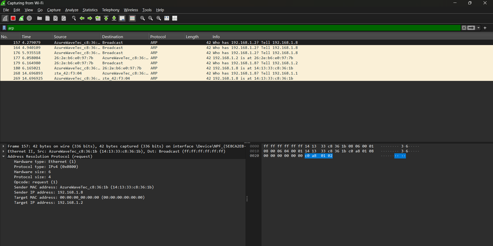
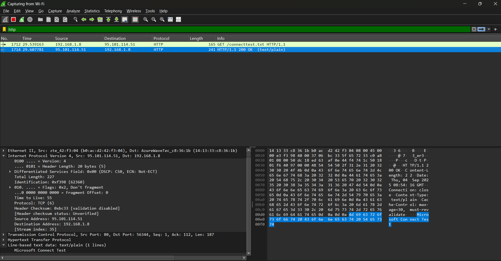

# 🌐 NetDiag - Network Diagnostic Toolkit (Node.js)

**NetDiag** is an educational project that demonstrates how core networking protocols (IP, ICMP, ARP) work through a simple backend application built with **Node.js**.  
The project provides a set of **REST APIs** for network testing and analysis, along with real Wireshark packet captures.

📖 [API Documentation](https://documenter.getpostman.com/view/37188310/2sB3HjP2iu)

---

## 🚀 Features

- 🔹 **IP Tools**

  - `/ip/myip` → Returns the server’s Private & Public IP
  - `/ip/client` → Returns the client’s IP address

- 🔹 **ICMP Tools**

  - `/icmp/ping/:host` → Perform a Ping test on the given host
  - `/icmp/traceroute/:host` → Perform a Traceroute to the given host

- 🔹 **ARP Tools**

  - `/arp/:ip` → Retrieve the MAC Address of a device in the local network

- 🔹 **Logs**
  - `/log` → View logs of previous operations

---

## 🛠️ Tech Stack

- Node.js
- Express.js
- node-arp
- ping
- traceroute
- Wireshark (for packet analysis)

---

## 📸 Wireshark Captures

### 1. ICMP Ping



### 2. ICMP Traceroute (Time Exceeded)



### 3. ARP Request/Reply



### 4. HTTP Request/Response



---

## 📂 Project Structure

```
NetDiag/
│── public/ # Wireshark captures
│── routes/ # API routes
│── utils/ # Utility files (logging, tools, etc.)
│── server.js # Application entry point
│── package.json
└── README.md
```

---

## ⚙️ Installation & Usage

```bash
# Install all dependencies and build frontend
npm run build

# Run backend with nodemon in development mode
npm run dev
```

## 👨‍💻 Author

**Mostafa Adly**  
GitHub: [@Mostafa-36](https://github.com/Mostafa-36)  
LinkedIn: [@mostafa-adly](https://www.linkedin.com/in/mostafa-adly-a10726274/)

> ⭐️ Star this project if you like it — it motivates open-source development!
